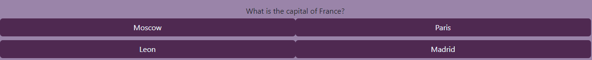

# Who wants to be a millionaire game 
Visit a live version of the site: https://robbatchcoder.github.io/Manzuko-restaurant/
## Contents

* [Project Description](#project-description)
* [User Experience](#user-experience)
* [Creation Process](#creation-process)
* [Design](#design)
    * [Colour Scheme](#colour-scheme)
    * [Logo](#logo)
    * [Typography](#typography)
    * [Imagery](#imagery)
* [Responsive design](#responsive-design)
    * [Desktop, tablet and mobile differences](#desktop-tablet-and-mobile-differences)
    * [Tablet view](#tablet-view)
    * [Mobile view](#mobile-view)
* [Future Features](#future-features)
* [Technologies used](#technologies-used)  
    * [Languages used](#languages-used)
    * [Frameworks, libraries & programs used](#frameworks-libraries--programs-used)
* [Deployment](#deployment)
* [Testing](#testing)
* [Acknowledgements](#acknowledgements)

# Project Description
The project's goal was to create an interactive quiz game in the style of the popular TV game show, Who wants to be a millionaire?
Utalising HTML, CSS and Javascript the project both reads and writes to the DOM to create the interactive experience.

# User Experience
## Primary Goal

# Creation Process
 
## 1. Strategy
* The game need to be simple and intuative as the users may not nessisarily tech savy.
* The game must track the score of the user so as to return feed back on their performance.
* The website requires a responsive design so that it can be used on a variety of devices.

## 2. Scope
* The webpage consists only of those elements used in the game with minimal additional content. 
* The website utilises the bootstrap framework to create a responsive site.
* The choice to use the well know brand of Who wants to be a millionaire ensures users who are familour with
it will immediately understand the concept of the game.

## 3. Structure
* The game follows a simple stucture with the score tracker, logo and life lines positioned at the top of the view windown and 
the quiz questions and answers places at the bottom of the view window.

## 4. Skeleton

## 5. Surface

## 5. Wireframe 

# Design
## Colour Scheme

## Logo

## Typography
The fronts for this project were taken from https://www.cdnfonts.com/ . 
 * Shameimaru-sans was chosen for all headers in the project for its elegant and minimalist look. This suited the subtle and elegant     design for the project.
 
 * Montserrat was chosen for the paragraph elements as it contrasted well with Shameimaru-sans and remained easily readable at smaller
 sizes.
 
 
## Imagery 
All images were taken from https://stock.adobe.com/uk/. These are all free licenced materials.

 

# Existing Features

## Score tracker

 

### Code
As the global score variable is updated the increase score function adds a class to the next prize in the HTML, this class has border styling in the CSS. As the score iterates the "removeLastScore" function removes the previously assigned score from the HTML element.

## Life lines

 

### Code
The "removeButton" function permanently removes the life line button once pressed so that it cannot be used again on each further questions. The Id of each button is sent to the function so that specific button is removed while the others remain.  

The "removed2Answers" function is triggered when the life line button is pressed. It generates a random number, converts it into a character and tests that character against the character representing the correct answer to the question. If it doesn't match the correct answer, that character is pushed into a string. The (Do, while) loop contiues until the string contains 2 characters, neither of which match the correct answer. These characters are then assigned to the GetElementById
function which adds the blocker class to the corresponding answer boxing, thus removing them from the users view.

## Question and answers section

### Code
The set up function initialses the event listeners for all the buttons used in the program. This function also calls the 
"loadQuestions" functions with the first question in the "questions" object.

The button pressed functions pass the answer box values to the "checkAnswers" function.

The check answer function compares the user responce against the result value-property pair in the questions object. If correct this function iterates the score and current question global variables. It also sends the updates score to the scoreIncrease funtion. If incorrect this function calls the game over function. Finally this funtion will load the next question.

The "loadQuestion" function takes the current question global variable and loads the corresponding qution from the questions object.  

The "gameOver" funtion is run when the user inputs an incorrect answers, it alerts that user with a gameover message then resets the game to the start.

The "winGame" function is won when the score variable reaches 15, meaning the player has answered all question correctly. This function then alerts the user they have won and resets the game.

# Responsive design
The game utalises the Bootstrap frameworks grid system to create a responsive design. 
  

# Technologies used
## Languages used
* HTML5
* CSS3
* Javascript

## Frameworks, libraries & programs used
* Bootstrap 5.2.3
* Cooler.co - Used to create colour palette
* Figma - Used for wireframing
* Chrome Dev tools - Used for trouble shooting
* Google lighthouse - Used for testing
* W3C Validator - Used to test errors in html and css
* Wix - Used to create logo
* GitHub - Used for version control 
* GitPod - Cloud IDE and dev ops
* Google images - Used to source images.

# Deployment
The project was deployed on GitHub Pages.

# Testing
Using the lighthouse testing facility on Google Chrome highlighted a number of issues. 

## 1. Performance

## 2. Accessibility

## 3. Best Practices

## 4. Search engine optimization

## HTML Validator

## CSS Validator

To test html code the html validator https://validator.w3.org/. The CSS page was tested improved until the validator 
returned 0 errors.

# Acknowledgements

* I'd like to thanks Code Institute for putting together an excellent course and giving me the opportunity to reach my
career goals.
* I'd also like to thank Richey Malhotra for his excellent advice, mentorship and insight. This project would have looked 
very different without his help and I'm immensely grateful for all he has given me and my fellow course members.

